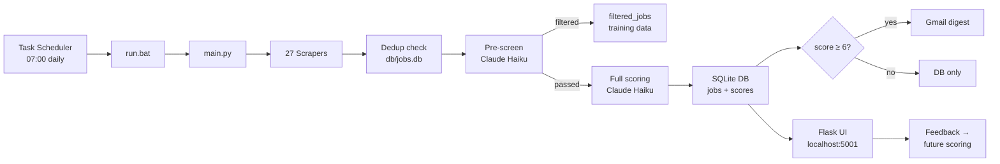

# Job Scraper

A personal, automated job-hunting pipeline built for Timo van Ommeren. It scrapes 27 sources daily (24 active + 3 disabled behind CDN blocks), runs a cheap Claude pre-screen to filter out irrelevant postings, scores each remaining job against Timo's profile using Claude (Haiku), and sends an email digest whenever a strong match (score ≥ 6/10) is found. Target roles: researcher, data analyst, policy analyst, PhD student, traineeship — at EU institutions, UN agencies, think tanks, Dutch research institutes, and UK universities.

Runs automatically via Windows Task Scheduler. No manual intervention needed once set up.

---

## How It Works



---

## Scraper Status

| Source | Type | Status |
|---|---|---|
| EURAXESS | EU research jobs | ✅ Active |
| AcademicTransfer | PhD + postdoc (NL) | ✅ Active |
| Impactpool | International orgs | ✅ Active |
| JRC | EC Joint Research Centre PhD | ✅ Active |
| RAND Corporation | Workday API | ✅ Active |
| CASE Poland | Think tank | ✅ Active |
| Busara Center | Lever API | ✅ Active |
| WODC | werkenvoornederland.nl | ✅ Active |
| SCP | werkenvoornederland.nl | ✅ Active |
| Trimbos-instituut | Playwright (JS) | ✅ Active |
| EU Careers | Playwright (JS), seasonal | ✅ Active (Mar/Oct intakes only) |
| FGV | Playwright (JS) | ✅ Active |
| EPSO Blue Book | requests, seasonal | ✅ Active (Mar/Oct intakes only) |
| Utrecht University | requests + BS4 | ✅ Active — [closes #8](https://github.com/timovanommeren/job_scraper/issues/8) |
| Tilburg University | Playwright (SAP SuccessFactors) | ✅ Active |
| Erasmus University Rotterdam | requests + BS4 | ✅ Active |
| Radboud University | requests + BS4 | ✅ Active |
| University of Amsterdam | Playwright | ✅ Active |
| Vrije Universiteit Amsterdam | Playwright | ✅ Active |
| University of Groningen | Playwright (click-navigate) | ✅ Active (~12/run, first page only) |
| OECD | SmartRecruiters API | ✅ Active |
| BIT | requests + BS4 (WordPress) | ✅ Active |
| EURAXESS MSCA | requests + BS4 (MSCA+R1 filter) | ✅ Active — MSCA Doctoral Networks |
| jobs.ac.uk | requests + BS4 (search + JSON-LD) | ✅ Active — UK drug-policy research |
| TNI | — | ❌ Disabled — IP-level 429, manual weekly check ([issue #1](https://github.com/timovanommeren/job_scraper/issues/1)) |
| UN Careers | — | ❌ CloudFront 403 — [issue #2](https://github.com/timovanommeren/job_scraper/issues/2) |
| EUDA | — | ❌ Cloudflare block — [issue #23](https://github.com/timovanommeren/job_scraper/issues/23) |

---

## Scheduled Tasks

| Task | Runs | Schedule |
|---|---|---|
| `JobScraperFeedbackServer` | `pythonw.exe feedback\server.py` | At every Windows logon (persistent) |
| `JobScraperDaily` | `run.bat` → `python main.py` | Daily at 07:00 |
| `JobScraperWeeklyDigest` | `python main.py --weekly-digest` | Every Tuesday at 08:00 |
| `JobScraperFeedbackSync` | `python.exe feedback\cf_sync.py` | Legacy — no-op since Architecture C (KV removed); safe to delete |

The daily task only sends an email when at least one job scores ≥ 6/10. The weekly digest emails everything found in the last 7 days, regardless of score, and includes a **"Your Field This Week"** section at the bottom: Claude analyses your highest-rated jobs from the past 90 days, writes a 2–3 sentence field profile, and suggests up to 3 organisations worth adding as scrapers. Each suggestion includes a careers page link and a one-tap "Skip" button that prevents it from appearing again.

---

## Common Commands

```bash
python main.py                      # Full pipeline: scrape → pre-screen → score → DB → email (if score ≥ 6)
python main.py --test               # Scrape + score, print digest preview — no DB writes, no email
python main.py --dry-run            # Scrape + score + write DB — no email
python main.py --site euraxess      # Run one scraper only (combine with --test for safe debugging)
python main.py --weekly-digest      # Send weekly summary of last 7 days and exit
python main.py --weekly-digest --test  # Preview weekly digest without sending
python main.py --backfill-deadlines # Extract deadlines for jobs where deadline is NULL
python main.py --reprocess 10       # Re-score last 10 failed extractions from DB
```

---

## Feedback & Local UI

The Flask app at **http://localhost:5001** lets you browse all scraped jobs, filter by relevance tier, and rate them. Each job's detail page has a 1–10 overall slider, five per-criterion sliders (Topic relevance, Methods match, Organization appeal, Career stage fit, Location), a freetext box, and an "✅ Applied" button once initial feedback is submitted. It starts automatically at login — no manual start needed.

A **health dashboard at http://localhost:5001/dashboard** answers the question "did the scraper run today, and if no email arrived, why not?" The top of the page shows a single colour-coded verdict for the last run (sent / nothing strong today / nothing new / partial / failed / crashed / next run due), followed by run detail and per-source yields. Below it, a 30-day panel shows run success rate, what kinds of jobs were found (were they all PhDs?), which sources deliver the most strong matches, the score distribution, and feedback engagement. The same numbers are available as JSON at `/api/v1/stats`. (API-cost tracking arrives in a later update.)

A **settings page at http://localhost:5001/settings** lets you edit pipeline parameters (score thresholds, max jobs per email, the field-intelligence trigger) without touching the YAML files directly.

Every email digest includes a **1–10 rating row** per job (two rows of 5 number pills). Tapping a number records your score immediately — no form to open. When `CF_WORKER_URL` and `CF_WORKER_SECRET` are configured, the rating row uses HMAC-signed Cloudflare Worker links (7-day weekly bucket, so links stay valid all week) that work on any device including your phone. The Worker POSTs each rating straight to the Flask API over a Cloudflare Tunnel — there's no KV store or batch sync (`feedback/cf_sync.py` is a legacy no-op since the Architecture C migration).

Your ratings feed back into the scoring system prompt in two ways: past feedback entries appear as few-shot calibration examples (with per-criterion scores for richer context), and organisations you've rated ≥ 8 twice or marked as applied get a persistent +1–2 point boost written to `config/profile.yaml`.


---

## Setup

See [SETUP.md](SETUP.md) for installation, environment variables, Gmail App Password configuration, and Task Scheduler registration.

For a full explanation of every file, the database schema, the scoring prompt, and the feedback loop, see [ARCHITECTURE.md](ARCHITECTURE.md).
