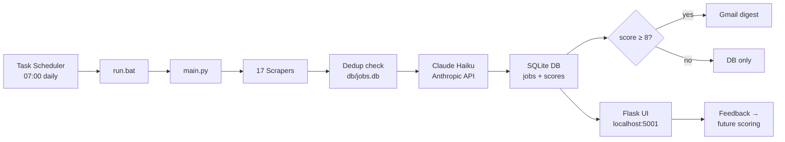

# Job Scraper

A personal, automated job-hunting pipeline built for Timo van Ommeren. It scrapes 17 sources daily, scores each posting against Timo's profile using Claude (Haiku), and sends an email digest whenever a strong match (score ≥ 8/10) is found. Target roles: researcher, data analyst, policy analyst, PhD student, traineeship — at EU institutions, UN agencies, think tanks, and Dutch research institutes.

Runs automatically via Windows Task Scheduler. No manual intervention needed once set up.

---

## How It Works



---

## Scraper Status

| Source | Type | Status |
|---|---|---|
| EURAXESS | EU research jobs | ✅ Active |
| AcademicTransfer | PhD + postdoc (NL) | ✅ Active |
| Impactpool | International orgs | ✅ Active |
| JRC | EC Joint Research Centre PhD | ✅ Active |
| RAND Corporation | Workday API | ✅ Active |
| CASE Poland | Think tank | ✅ Active |
| Busara Center | Lever API | ✅ Active |
| WODC | werkenvoornederland.nl | ✅ Active |
| SCP | werkenvoornederland.nl | ✅ Active |
| Trimbos-instituut | Playwright (JS) | ✅ Active |
| EU Careers | Playwright (JS), seasonal | ✅ Active (Mar/Oct intakes only) |
| FGV | Playwright (JS) | ✅ Active |
| EPSO Blue Book | requests, seasonal | ✅ Active (Mar/Oct intakes only) |
| TNI | requests | ⚠️ Always 429 — [issue #1](https://github.com/timovanommeren/job_scraper/issues/1) |
| UN Careers | — | ❌ CloudFront 403 — [issue #2](https://github.com/timovanommeren/job_scraper/issues/2) |
| OECD | — | ❌ Cloudflare — [issue #3](https://github.com/timovanommeren/job_scraper/issues/3) |
| BIT | — | ❌ Cloudflare + 0 positions — [issue #4](https://github.com/timovanommeren/job_scraper/issues/4) |

---

## Scheduled Tasks

| Task | Runs | Schedule |
|---|---|---|
| `JobScraperFeedbackServer` | `pythonw.exe feedback\server.py` | At every Windows logon (persistent) |
| `JobScraperDaily` | `run.bat` → `python main.py` | Daily at 07:00 |
| `JobScraperWeeklyDigest` | `python main.py --weekly-digest` | Every Tuesday at 08:00 |
| `JobScraperFeedbackSync` | `python.exe feedback\cf_sync.py` | Every hour (optional) |

The daily task only sends an email when at least one job scores ≥ 8/10. The weekly digest emails everything found in the last 7 days, regardless of score. The feedback sync task is only active when `CF_WORKER_URL` and `CF_WORKER_SECRET` are set in `.env`.

---

## Common Commands

```bash
python main.py                      # Full pipeline: scrape → score → DB → email (if score ≥ 8)
python main.py --test               # Scrape + score, print digest preview — no DB writes, no email
python main.py --dry-run            # Scrape + score + write DB — no email
python main.py --site euraxess      # Run one scraper only (combine with --test for safe debugging)
python main.py --weekly-digest      # Send weekly summary of last 7 days and exit
python main.py --weekly-digest --test  # Preview weekly digest without sending
python main.py --backfill-deadlines # Extract deadlines for jobs where deadline is NULL
python main.py --reprocess 10       # Re-score last 10 failed extractions from DB
```

---

## Feedback & Local UI

The Flask app at **http://localhost:5001** lets you browse all scraped jobs, filter by relevance tier, and rate them. It starts automatically at login — no manual start needed.

Email feedback buttons (Interested / Pass / Rate) work on desktop via the local Flask app. When `CF_WORKER_URL` and `CF_WORKER_SECRET` are configured, the buttons use signed Cloudflare Worker links instead — these work on any device including your phone. Phone feedback syncs to the local DB hourly via `feedback/cf_sync.py`. Your ratings feed back into the scoring system prompt, so Claude adjusts future scores based on what you liked or passed on.

---

## Known Limitations

- **UN Careers, OECD** — blocked by CDN/Cloudflare. See issues [#2](https://github.com/timovanommeren/job_scraper/issues/2), [#3](https://github.com/timovanommeren/job_scraper/issues/3) for proposed workarounds (REST API, playwright-stealth).
- **BIT** — disabled; see [#4](https://github.com/timovanommeren/job_scraper/issues/4).
- **EU Careers** — returns 0 outside March/October intake windows. That's expected behaviour.

---

## Setup

See [SETUP.md](SETUP.md) for installation, environment variables, Gmail App Password configuration, and Task Scheduler registration.

For a full explanation of every file, the database schema, the scoring prompt, and the feedback loop, see [ARCHITECTURE.md](ARCHITECTURE.md).
